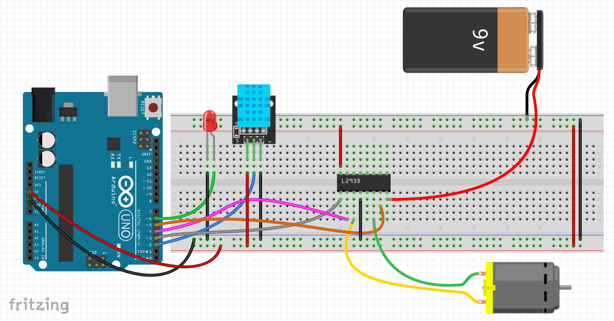
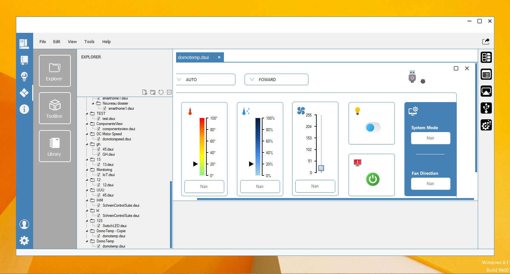
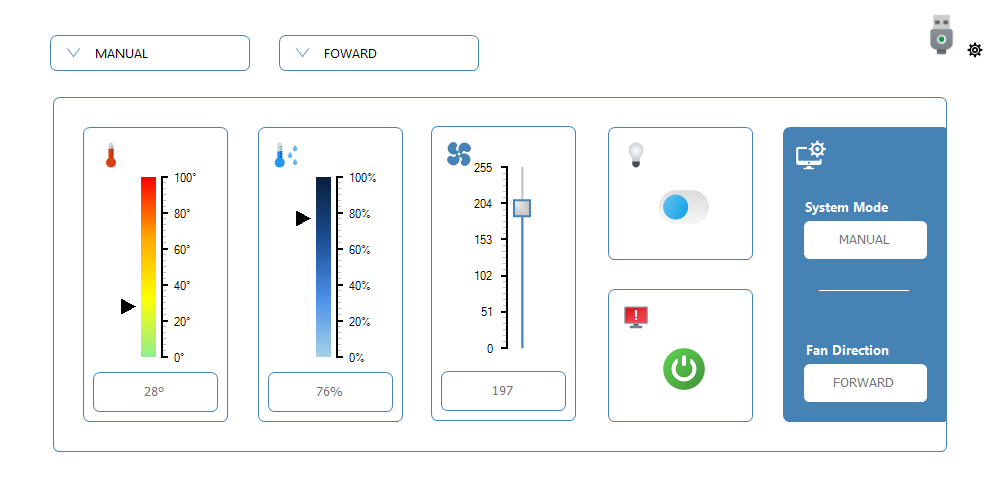
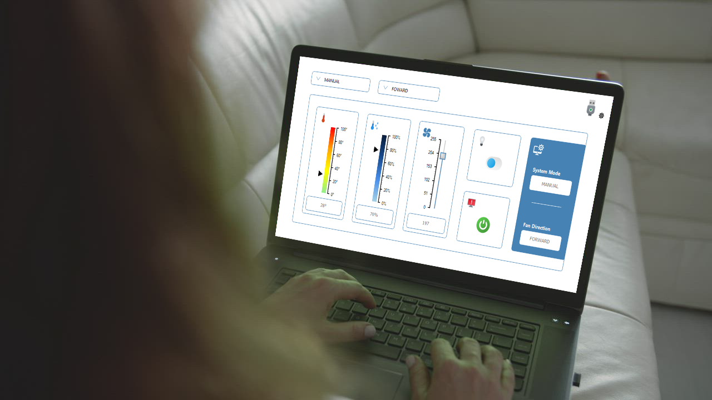

# 🏠 Domotemp - Système Intelligent de Monitoring Thermique


**Système complet de régulation thermique utilisant la bibliothèque SchreinSerialParser pour une communication série robuste et industrielle.**

## 📸 Vue d'ensemble du système


*Schéma de câblage complet du système Domotemp avec Arduino, L293D, DHT11 et relais*

## 📸 Conception graphique dans SchreinUIBuilder


*conception de l'interface de commande*

## 📸 Interface de commande


*Monitoring*

## 📸 Interface de commande


*Schéma de câblage complet du système Domotemp avec Arduino, L293D, DHT11 et relais*

## 🚀 Fonctionnalités Principales

### 🌡️ Monitoring Thermique Intelligent
- **Capteurs DHT11** : Mesure précise de température et humidité
- **Contrôle automatique** : Régulation entre 22°C et 30°C
- **Lecture périodique** : Mesures toutes les 2 secondes

### 🌀 Système de Ventilation Avancé
- **Driver L293D** : Contrôle précis du ventilateur DC
- **4 directions** : Forward, Reverse, Brake, Coast
- **Vitesse PWM** : Réglage de 0 à 255
- **Arrêt différé** : Sécurité thermique intégrée

### 🔧 Modes de Fonctionnement
- **🔄 Mode AUTO** : Régulation automatique complète
- **👨‍💼 Mode MANUAL** : Contrôle manuel des actionneurs
- **🧪 Mode TEST** : Calibration et tests système
- **🛑 Mode STOP** : Arrêt d'urgence sécurisé

### 🛡️ Sécurité et Robustesse
- **Arrêt d'urgence** : Protocole de sécurité immédiat
- **Watchdog** : Reset automatique en cas de blocage
- **Validation données** : Communication fiable avec checksum
- **Gestion d'erreurs** : Callbacks dédiés aux erreurs

## 📋 Matériel Requis

### Composants Électroniques
| Composant | Quantité | Rôle |
|-----------|----------|------|
| Arduino Uno/Nano | 1 | Carte de contrôle principale |
| Capteur DHT11 | 1 | Mesure température/humidité |
| Driver L293D | 1 | Contrôle moteur ventilateur |
| Ventilateur DC | 1 | Refroidissement système |
| Relais 5V | 1 | Commutation ampoule chauffante |
| Ampoule chauffante | 1 | Élément de chauffage |
| Breadboard | 1 | Prototypage circuits |
| Câbles Dupont | - | Interconnexions |

### Brochage Arduino
```cpp
#define DHT_PIN             2     // Données DHT11
#define FAN_ENABLE_PIN      3     // PWM vitesse ventilateur  
#define FAN_INPUT1_PIN      4     // Direction L293D IN1
#define FAN_INPUT2_PIN      5     // Direction L293D IN2
#define BULB_RELAY_PIN      6     // Commande relais ampoule
